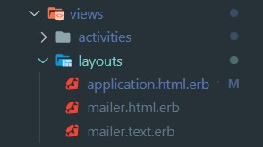
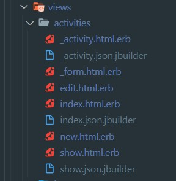
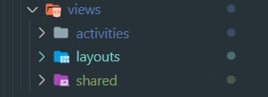
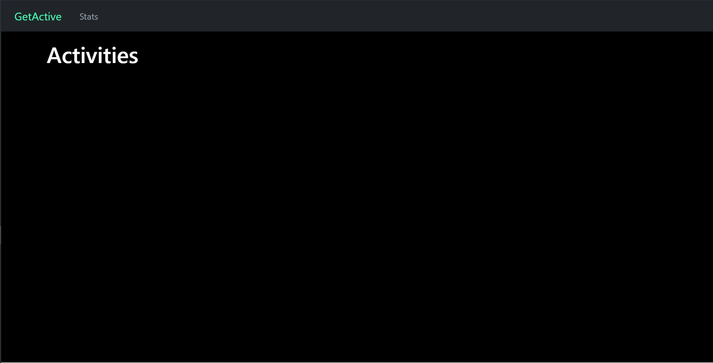
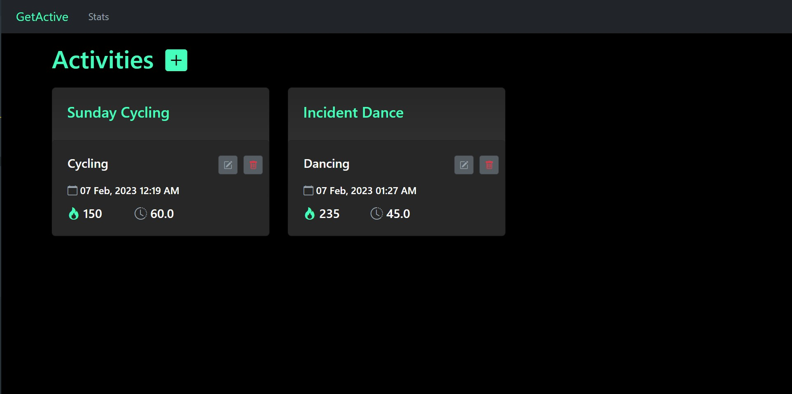
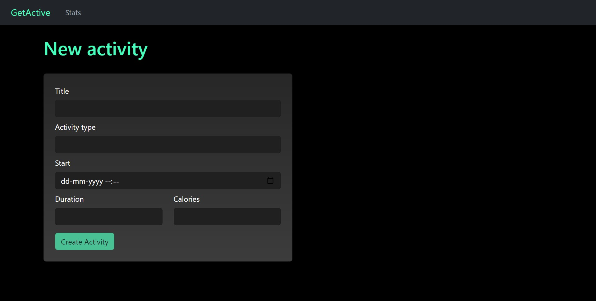

# Week 5 - Views

So after 4 weeks, we have our basic app ready! 🥳
However, there is one problem. It looks 🥴. Lets fix that! We'll now style our application using [Bootstrap](https://getbootstrap.com/docs/5.0/getting-started/introduction/) and look at the _View_ layer which is responsible for presenting data appropriately.

In a Rails application, the views are stored in app/views folder.
Each controller has their own views and the name of view file must match the action name _exactly_. Depending on the action executed, the views are used.

## Views as HTML Files

At a basic level, views are HTML files in which we insert information
from our controllers. As views are HTML files, anything that works in
HTML, CSS and Javascript works here. If you need a refresher 👇🏻

- [HTML Tutorial](https://github.com/IRIS-NITK/IRIS-RoR-Bootcamp-2022/blob/main/week_1/HTML.md)
- [CSS Tutorial](https://github.com/IRIS-NITK/IRIS-RoR-Bootcamp-2022/blob/main/week_1/CSS.md)

## Bootstrap

Bootstrap is a free and open-source CSS framework directed at responsive, mobile-first front-end web development. It contains HTML, CSS and JavaScript-based design templates for typography, forms, buttons, navigation, and other interface components.

> Why you ask?
> We could write all of our styling on our own but thats hard and time consuming.


### Installing Bootstrap

> **We have already done this for you but this is so that you know how to do it later**

Under the `activity-tracker` go to the `Gemfile` and add the Bootstrap Ruby gem by pasting the following code at the end of the file.

```
gem 'bootstrap', '~> 5.2.2'
```

On the terminal run `bundle install`

Rename `app/assets/stylesheets/application.css` to `app/assets/stylesheets/application.scss`: and import Bootstrap styles by adding:

```
@import "bootstrap";
```

You are all set and you should now see slightly different styling! 🚀

> Reference: [Installing Bootstrap Gem and jQuery in Rails](https://github.com/twbs/bootstrap-rubygem/blob/main/README.md)

## Let's Style

> Throughout this section, I will add some styling while also explaning View concepts

> Note: The dark-mode.css file has already been added in `/app/assets/stylesheets` which adds the theme and the colour shceme for the project.

> Bootstrap Icons have also been added for ease

### Understanding the project directory



- The `activity` folder contains all the view files related to the `Activity` Model. This would be repeated for all the other models you'd make in an application.

  Using Scaffolds, Rails creates even the view files for all basic actions including `index`, `show`, `edit`, `create` and `delete`! 🤯

  

- The `layouts` folder contains the base layouts for differrent formats which are inhereted in all other view files. For HTML files, `application.html.erb` is used as a base everywhere else

    ```erb

    <!DOCTYPE html>
    <html>
    <head>
        <title>ActivityTracker</title>
        <meta name="viewport" content="width=device-width,initial-scale=1">
        <%# <link href="" rel="stylesheet"> %>
        <%= csrf_meta_tags %>
        <%= csp_meta_tag %>

        <%= stylesheet_link_tag "application", "data-turbo-track": "reload" %>
        <%= stylesheet_link_tag "dark-mode", "data-turbo-track": "reload" %>
    <link rel="stylesheet" href="https://cdn.jsdelivr.net/npm/bootstrap-icons@1.10.3/font/bootstrap-icons.css">

        <%= javascript_importmap_tags %>
    </head>

    <body>
        <%= yield %>
    </body>
    </html>

    ```

## Partials and Navbar

When writing Ruby, we break up complex methods into multiple, smaller methods. Likewise, when writing views, we break up complex view files into smaller partials.

- The partials are named with the leading underscore and are in the same directory as the original view.
- You can pass variables to partials using locals keyword.

Since the Navbar will be used at all places and can be repetitive, we will create a navbar partial.

- Create a `shared` folder inside the `views` folder

  

- Create a file named `_navbar.html.erb` inside and paste the following code. We'll be using the Bootstrap Navbar component for this

  ```erb

  <nav class="navbar navbar-expand-lg bg-dark">
    <a class="navbar-brand mx-4 text-primary" href="/">GetActive</a>
    <button class="navbar-toggler" type="button" data-toggle="collapse" data-target="#navbarNavDropdown" aria-controls="navbarNavDropdown" aria-expanded="false" aria-label="Toggle navigation">
      <span class="navbar-toggler-icon"></span>
    </button>
    <div class="collapse navbar-collapse" id="navbarNavDropdown">
      <ul class="navbar-nav">
        <li class="nav-item active">
          <a class="nav-link text-secondary" href="#">Stats</a>
        </li>
      </ul>
    </div>
  </nav>

  ```

- Now we need to reference this navbar so that Rails knows how to serve it.
- Inside `application.html.erb`, use `<%= render partial: 'shared/navbar' %>` to render the navbar partial.
- We have also wrapped the `<%= yield %>` tag inside a container to give the entire layout some margin and padding.

  ```erb

    <body>
      <%= render partial: 'shared/navbar' %>
      <div class="container">
        <%= yield %>
      </div>
    </body>

  ```

> Note that we dont use shared/_navbar. Rails is smart enough to know that since its a partial, it will begin with _!



Now it looks better, doesn't it?


> Reference and further reading - [Using Partials](https://guides.rubyonrails.org/layouts_and_rendering.html#using-partials)

## Embedded Ruby

Embedded Ruby refers to pieces of code in between HTML code, to make the
views dynamic and extensible.

There are two ways of invoking ERB:
- `<%=` and `%>` wrap Ruby code whose return value will be output in
  place of marker.
- `<%` and `%>` wrap Ruby code whose return value will NOT be output.

```
# Displays current time
<p>Page generated at: <%= DateTime.now %></p>

# Does display not current time
<p>Page generated at: <% DateTime.now %></p>
```

The non-returning tag is used for iterating and preparing data:

```erb
<% @activities.each do |activity| %>
  <tr>
    <td><%= activity.title %></td>
    <td><%= activity.calories %></td>
    ...
  </tr>
<% end %>
```

The variables are shared between the controller and views using [instance
variables](https://www.rubyguides.com/2019/07/ruby-instance-variables/), that is variables prefixed by `@`:

```ruby
class ActivitiesController < ApplicationController
  def index
    @activities = Activity.all
  end
end
```

```erb
<% @activities.each do |activity| %>
  <tr>
    <td><%= activity.title %></td>
    <td><%= activity.calories %></td>
    ...
  </tr>
<% end %>
```

## Improving Index Page

We will improve the look of the activities index page using [Bootstrap Card Deck](https://getbootstrap.com/docs/4.0/components/card/#card-decks) component.

- Style the file using this code

  ```erb

  <p style="color: green"><%= notice %></p>

  <h1 class="text-primary">
      Activities
      <small><%= link_to "<i class='bi bi-plus-square-fill text-primary mx-2'></i>".html_safe, new_activity_path %></small>
  </h1>

  <div id="activities" class="mt-4 card-deck">
    <% @activities.each do |activity| %>
      <div class="col-sm-12 col-md-6 col-lg-4">
        <%= render activity %>
      </div>
    <% end %>
  </div>

  ```
- We have wrapped our `#activities` section inside a `card-deck` and provided a top margin of 4 units. `col-sm-12 col-md-6 col-lg-4` creates a grid of cards which render one in a row on small devices, two in a row on medium devices and three in a row on large devices.

  > Remember the bootstrap grid system? The grid is divided into 12 parts. `col-lg-4` would mean that it would take up only three columns worth space and hence three cards in a row. Similarly with other viewports.

- We have moved the New Activities button inside the heading and used a plus icon instead using [Bootstrap Icons](https://icons.getbootstrap.com/) (which has already been added by us in `application.html.erb` using the CDN)

- Another thing you would notice here is the `link_to` helper.

  To make the process of adding hyperlinks easier, Rails provides us with a helper function to generate the markup - `link_to`.

  In plain HTML, you create a link like this:

  ```html
  <a href="/activities">Activities</a>
  ```

  But in Rails that would look like this:

  ```erb
  <%= link_to "Activities", activities_path %>
  ```

  _Why?_ 🤔

  Because we use routes in Rails.

  We want to take advantage of that by using `_path` methods & making that the target (href) of our link.

  Using link_to makes this easier because we don’t have to [interpolate](https://www.rubyguides.com/2019/07/ruby-string-concatenation/) the value.

  > You can see all path methods if you type `rails routes` on the terminal or visit a wrong link in your project

  You can also add classes and other arguments like:

  ```erb
  <%= link_to "Activities", activities_path, class: "..." %>
  ```

  - [Further Reading](https://www.rubyguides.com/2019/05/rails-link_to-method/)

## Improving the Card

In the last section you would have noticed the use of `<%= render activity %>` which magically renders all our activities. Where is this coming from? The answer is in `_activity.html.erb`

> Remeber partials?

- Replace the `_activity.html.erb` code with the following code to style our boring looking cards

```erb

<div id="<%= dom_id activity %>" class="card">
  <h4 class="card-title text-primary p-4"><%= activity.title %></h4>
  <div class="card-body p-3">
    <div class="row p-2">
      <div class="col-9">
        <h5 class="card-text"> <%= activity.activity_type %></h5>
      </div>
      <div class="col-3">
        <div class="row">
          <div class="col-6">
            <%= link_to "<i class='bi bi-pencil-square text-secondary'></i>".html_safe, edit_activity_path(activity), class: "btn btn-sm btn-secondary" %>
          </div>
          <div class="col-4">
            <%= button_to "<i class='bi bi-trash text-danger'></i>".html_safe, activity, method: :delete, class: "btn btn-sm btn-secondary" %>
          </div>
        </div>
      </div>
    </div>
    <div class="row p-2">
      <div class="col-8">
        <h6 class="card-text"><i class="bi bi-calendar text-secondary"></i> <%= activity.start.in_time_zone.strftime("%d %b, %Y %I:%M %p") %></h6>
      </div>
    </div>
    <div class="row p-2">
      <div class="col-4">
        <h5 class="card-text"><i class="bi bi-fire text-primary"></i> <%= activity.calories %></h5>
      </div>
      <div class="col-6">
        <h5 class="card-text"><i class="bi bi-clock-history text-secondary"></i> <%= activity.duration %></h5>
      </div>
    </div>
  </div>
</div>

```

- The activity variable is passed onto this file from `index.html.erb` and used here. All the attributes of our model (title, activity_type, calories and duration) are now available to us with each acitivity object can be used using the `.` operator.

- We have used the [Bootstrap Card](https://getbootstrap.com/docs/4.0/components/card/) component, some custom gradients, shadows, padding, margins and the grid system to create this.

- We have also used Bootstrap icons to add icons

  > Notice the usage of the `link_to` helper for the edit action

- Another thing you would notice is the `button_to` tag. It works similar to the `link_to` tag and you can read about it more [here](https://apidock.com/rails/v5.2.3/ActionView/Helpers/UrlHelper/button_to)

- Last thing to note is:

  ```erb
  <%= activity.start.in_time_zone.strftime("%d %b, %Y %I:%M %p") %>
  ```

  Rails also provides with helper functions to achieve simple manipulations on `view` data to render it in a nicer fashion. You would see that it now renders the datetime in a more human readable format.

  `strftime` is an inbuilt helper. You can also define your own helpers. You can read about them [here](https://www.rubyguides.com/2020/01/rails-helpers/)

- With this, our index page now looks like this. How cool is that! 🔥



## Improving the form

The HTML form when we are creating or editing an activity is stored in `app/views/activities/_form.html.erb`. Since the file name begins with an underscore, it is a partial. Taking a closer look:

```erb

<%= form_with(model: activity) do |form| %>
  <% if activity.errors.any? %>
    <div style="color: red">
      <h2><%= pluralize(activity.errors.count, "error") %> prohibited this activity from being saved:</h2>

      <ul>
        <% activity.errors.each do |error| %>
          <li><%= error.full_message %></li>
        <% end %>
      </ul>
    </div>
  <% end %>

  <div>
    <%= form.label :title, style: "display: block" %>
    <%= form.text_field :title %>
  </div>

  <div>
    <%= form.label :activity_type, style: "display: block" %>
    <%= form.text_field :activity_type %>
  </div>

  <div>
    <%= form.label :start, style: "display: block" %>
    <%= form.datetime_field :start %>
  </div>

  <div>
    <%= form.label :duration, style: "display: block" %>
    <%= form.text_field :duration %>
  </div>

  <div>
    <%= form.label :calories, style: "display: block" %>
    <%= form.number_field :calories %>
  </div>

  <div>
    <%= form.submit %>
  </div>
<% end %>

```

- The `form_with` tag takes a model (or a url), fields and generates a
HTML form. For example, by passing the variable `activity` as an local
variable to the partial, Rails figures out whether to create a new
activity or to update an existing activity and pre-fill the forms.

- The `activity.errors` variable stores any errors that occur during
saving the record.

- Just like the `link_to` and `button_to`, Rails also has Form Helpers

  `form.label` creates an equivalent `<label>` tag where `:attribute_name` represents the model attribute the label is for

  For eg:

  ```erb
  <%= form.label :title, style: "display: block" %>
  ```

  is for the `title` of our activity.

  Here are some more helpers with self-explanatory names

  ```erb
  <%= form.text_field :activity_type %>
  <%= form.text_area :message, size: "70x5" %>
  <%= form.hidden_field :parent_id, value: "foo" %>
  <%= form.password_field :password %>
  <%= form.number_field :price, in: 1.0..20.0, step: 0.5 %>
  <%= form.range_field :discount, in: 1..100 %>
  <%= form.date_field :born_on %>
  <%= form.time_field :started_at %>
  <%= form.datetime_local_field :graduation_day %>
  <%= form.month_field :birthday_month %>
  <%= form.week_field :birthday_week %>
  <%= form.search_field :name %>
  <%= form.email_field :address %>
  <%= form.telephone_field :phone %>
  <%= form.url_field :homepage %>
  <%= form.color_field :favorite_color %>

  ```

- Replace the code in  `_form.html.erb` with the following code to create a modern looking form. We have used the [Bootstrap Card](https://getbootstrap.com/docs/4.0/components/card/), [Bootstrap Form Controls](https://getbootstrap.com/docs/4.0/components/forms/#form-controls), [Bootstrap Button](https://getbootstrap.com/docs/4.0/components/buttons/) and some padding, margins and gradients to style it.

  ```erb
  <div class="row">
    <div class="col-6">
      <div class="card mt-4 p-4">
        <%= form_with(model: activity) do |form| %>
          <% if activity.errors.any? %>
            <div style="color: red">
              <h2><%= pluralize(activity.errors.count, "error") %> prohibited this activity from being saved:</h2>

              <ul>
                <% activity.errors.each do |error| %>
                  <li><%= error.full_message %></li>
                <% end %>
              </ul>
            </div>
          <% end %>

          <div class="form-group mb-2">
            <%= form.label :title, style: "display: block" %>
            <%= form.text_field :title, class: "form-control mt-2" %>
          </div>

          <div class="form-group mb-2">
            <%= form.label :activity_type, style: "display: block" %>
            <%= form.text_field :activity_type, class:"form-control mt-2" %>
          </div>

          <div class="form-group mb-2">
            <%= form.label :start, style: "display: block" %>
            <%= form.datetime_field :start, class:"form-control mt-2" %>
          </div>

          <div class="row">
            <div class="col">
              <div class="form-group mb-2">
                <%= form.label :duration, style: "display: block" %>
                <%= form.text_field :duration, class:"form-control mt-2" %>
              </div>
            </div>
            <div class="col">
              <div class="form-group mb-2">
                <%= form.label :calories, style: "display: block" %>
                <%= form.number_field :calories, class:"form-control mt-2" %>
              </div>
            </div>
          </div>


          <div>
            <%= form.submit class: "btn mt-2 btn-primary text-dark" %>
          </div>
        <% end %>

      </div>
    </div>
  </div>

  ```

  

  That looks much better 😮‍💨

> References
>
> [Helpers for Generating Form Elements](https://guides.rubyonrails.org/form_helpers.html#helpers-for-generating-form-elements)
>
> [Action View Form Helpers](https://guides.rubyonrails.org/form_helpers.html)

## New and Edit files

If you have noticed, there are also the `new.html.erb`, `edit.html.erb` and `show.html.erb` files that we haven't styled yet.

Understanding them should now be a piece of cake for you 😉. Seeing any of these files, you would notice that they simply have a couple of links and then render some partial (`_form.html.erb` for `new` and edit and `_activity.html.erb` for `show`).

`new.html.erb`, `edit.html.erb` and `show.html.erb` files files act as the entry point for the `new`, `edit` and `show` action an in turn render a partial.

Replace their code with the following snippets to complete our styling:

- `new.html.erb`

  ```erb
  <div class="container">
    <h1 class="text-primary mt-4">New activity</h1>
    <%= render "form", activity: @activity %>
    <br>
  </div>
  ```

- `show.html.erb`

  ```erb
  <p style="color: green"><%= notice %></p>

  <%= render @activity %>
  ```

- `edit.html.erb`

  ```erb
  <div class="container">
    <h1 class="text-primary mt-4">Edit Activity</h1>
    <%= render "form", activity: @activity %>
    <br>
  </div>
  ```

And with that, we have turned our boring looking application to a modern design! ⚡

## Submission and Bonus Tasks

- Style the `/stats` page that you created last time
- Improve design of authentication-related views: Log In, Sign Up and Reset Password views (which were generated using `devise`).
- Use [Bootstrap Alerts](https://getbootstrap.com/docs/4.0/components/alerts/) or [Bootstrap Toasts](https://getbootstrap.com/docs/4.5/components/toasts/) to style the alerts
- Feel free to add/change any styling. We would love to see your designs! 💙

Once you are done with the design changes, create a pull request adding
screenshots of the website to the description to the pull request or the
project README.
